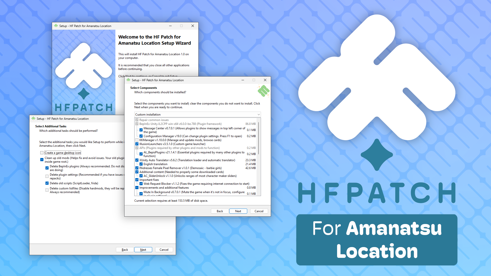

# HF Patch for Amanatsu Location!
An unofficial patch for [Amanatsu Location](https://www.illgames.jp/product/amaloca/) (甘夏ろけーしょん) with all free updates, fan-made English translations and essential mods. It will allow you to load all character cards and scenes and give you countless gameplay improvements while still keeping the original, uncluttered and clean feel of the game. All content is tested and fixed (or removed) as needed before each update. HF Patch can repair many common problems, try it if you have issues with your game or mod setup.

Read the [full HF Patch manual](https://gist.github.com/ManlyMarco/31b78470b8e190686c7ed9686c237e3f) to learn more about what it is, what it does, how to use it, and how to solve common issues.

HF Patch does not contain the full game, paid expansions or any other pirated content. You have to buy the game and expansions separately. You can buy the Japanese version of the game [on DLsite](https://www.dlsite.com/pro/work/=/product_id/VJ01006491.html) ([buy and download guide](https://youtu.be/gXhEcizjOLg)) or [on DMM](https://dlsoft.dmm.co.jp/detail/illgames_0007/) ([buy and download guide](https://youtu.be/SJ9OXedO3qI)). Both DLsite and DMM versions are essentially identical, just differently compressed.

You can support development of HF Patch and many of the included plugins through my Patreon page: https://www.patreon.com/ManlyMarco

## Download
Check the [Releases](https://github.com/ManlyMarco/AL-HF_Patch/releases) page for download links. The latest release is at the top. To get mail updates for each new release you can watch this repositiory (top right).

The download contains the entire HF Patch which can be used offline. You can use qBittorrent or a similar up-to-date torrent client to open the magnet link.

## How to install
1. Install the game (use a simple path like `D:\Games\AL` without any Japanese characters, otherwise mods and/or the game might have issues).
2. (Optional) Install any paid expansions that you have. You must install them before running the patch.
3. Download the latest HF Patch from the [releases page](https://github.com/ManlyMarco/AL-HF_Patch/releases) to any directory. Do not download it to the game directory!
4. Once all parts are downloaded, run the patch .exe file.
5. You can customize the install but for beginners it's recommended to use the default settings.
6. Wait until it's done (verification can take a long time) and enjoy the game!

*Note: If you want to run the game under Wine/Proton (Linux, SteamOS, macOS, etc.), read [this](https://github.com/Mantas-2155X/illusion-wine-guide) and [this](https://docs.bepinex.dev/articles/advanced/proton_wine.html).*

## What mods are included?
You can see a list of all included plugins and links to their websites and authors [here](https://github.com/ManlyMarco/AL-HF_Patch/blob/master/Plugin%20Readme.md). You can see what content mods are included after installing the patch by running KKManager (installed to the game directory) and navigating to the zipmods tab.

## Discussion and help
If you need any help, [check the wiki](https://wiki.anime-sharing.com/hgames/index.php?title=Amanatsu_Location) or visit the [Koikatsu discord server](https://discord.gg/hevygx6) and ask in #help or in #Amanatsu Chat. Asking in the #help channel instead of other places is the fastest way to get help, you can even search it for your issue to see if someone already answered it. There are also chat and card sharing channels on the server!

## Important notes, please read
Here are answers to some of the most commonly asked questions, please check them first before asking for help!

### General HF Patch
- HF Patch does not contain the full game, paid expansions or any other pirated content. The full game needs to be already installed for the patch to work.
- If you have installed a previous HF Patch or separate mods it is recommended to remove ALL mods when prompted. This will prevent any potential mod conflicts or outdated mods causing problems.
- All free patches and DLC are included. Paid and limited-access DLCs are not included, but they are not required for the patch to work. 
- You can run this patch as many times as you want and nothing will break. All mods are optional to install, and most can be removed by running the patch again.
- You can use this patch to fix many broken game/mod installs.
- It's recommended to install all content mods if you plan to download character cards - they are required by many cards and scenes.
- Older versions of BepInEx will be automatically upgraded, and most botched installations should get fixed by running this patch.
- Please leave the modders some positive feedback or help them in some other way!
- There is no warranty on this patch or on any of the included mods. You are installing this patch at your own risk. The base game and by extension this patch are not suitable for minors. If you are under 18 years old you can not use this patch. The base game and this patch contain only characters of age 18 or higher. The creator of this patch is not responsible for creations of its users and prohibits any unlawful use of this software.

## How to build
At least Visual Studio 2017 is needed for the helper library and the latest unicode Inno Setup compiler is needed for the patch itself. All necessary mods have to be placed inside correct subfolders of the Input directory to compile. Because of massive size, they are not included here.
